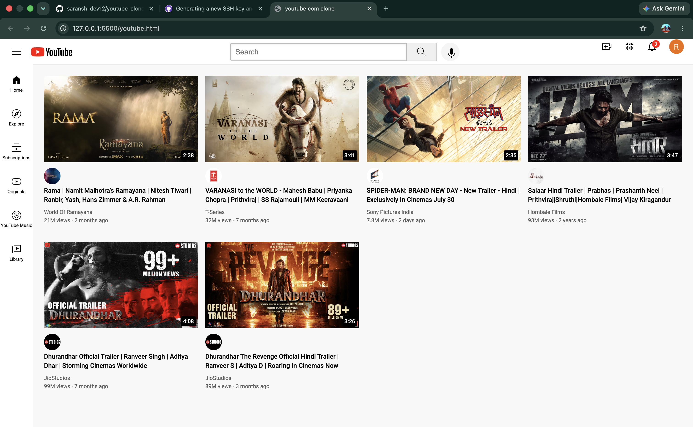

# YouTube Clone

A responsive YouTube homepage clone built using **HTML** and **CSS**. This project recreates the layout of YouTube's home page to practice modern frontend development concepts such as Flexbox, CSS Grid, responsive design, and reusable components.

## Features

- Responsive YouTube-inspired layout
- Header with search bar and navigation icons
- Sidebar navigation
- Video cards with thumbnails
- Channel profile pictures
- CSS Grid and Flexbox based layout
- Clean and organized project structure

## Built With

- HTML5
- CSS3
- Flexbox
- CSS Grid

## Project Structure

```
youtube-clone/
├── icons/
├── styles/
│   ├── general.css
│   ├── header.css
│   ├── sidebar.css
│   └── video.css
├── thumbnails/
├── youtube.html
└── README.md
```

##  Preview



## Purpose

This project was built as part of my frontend development journey to strengthen my understanding of HTML and CSS before moving on to JavaScript and React.

## Future Improvements

- Add JavaScript functionality
- Dark mode
- Responsive mobile navigation
- Video hover effects
- Search functionality

## Author

**Saransh Pandey**

GitHub: https://github.com/saransh-dev12